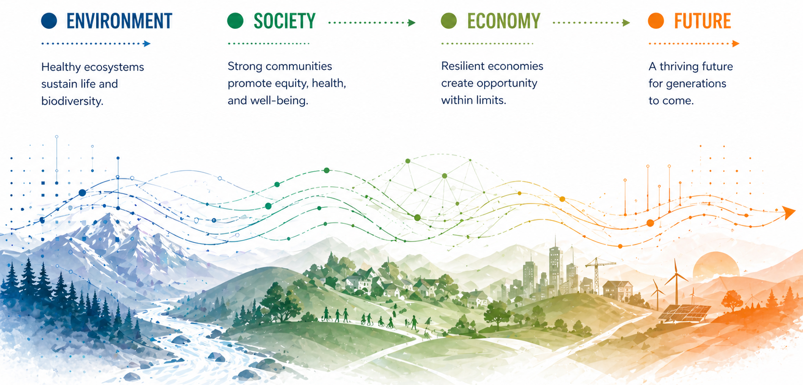
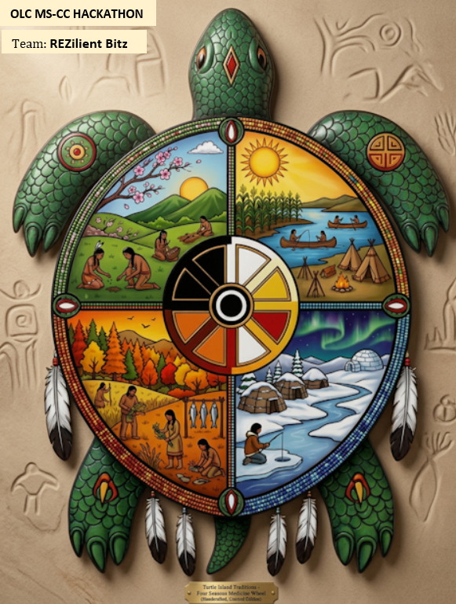

# REZilient Bitz : Seven Direction Framework for Biological Effects of Climate Change
*Incorporating our cultures viewpoint and values of Mitakuya Oyasin, we are all related and connected.*

Our project is approaching the Seven Direction Framework for Biological Effects of Climate Change. As well as, Kapemni, as above so below, further emphasizing our reflection and connection to all. Specifically utilizing the natural elements like earth, wind, fire, water, plants and animals, sky, and center (within us/ourselves). We will be showing one aspect through chokecherries that can potentially be used for other species.

## People and Roles

| Name | Tribal Affiliation | Contact | Starting role |
|---|---|---|---|
| Cecelia Two Lance | Oglala Lakota Sioux Tribe | Hackathon Participant | Team ReZilient Bitz |
| Amanda Ruiz | Rosebud Sioux Tribe | Hackathon Participant | Team ReZilient Bitz | 
| Corey Lawrence | Cheyenne River Sioux Tribe | Hackathon Participant | Team ReZilient Bitz | 

## Team Norms and Decision Making

Our team norms:
- Prioritize Mitakuye Oyasin, we are not seperate, we are all connected.
- Maintain balance.
- Ensure healing of our people and our lands.

Our decision rule:
Building relationships.

## Our Question 📣 

Being a good relative, how can we as data scientists promote healing through prioritizing Mitakuye Oyasin, we are not seperate
Using the Seven Direction Framework for Biological Effects of Climate Change. As well as, Kapemni, as above so below, further emphasizing our reflection and connection to all. Specifically utilizing the natural elements like earth, wind, fire, water, plants and animals, sky, and center (within us/ourselves). We will be showing one aspect through chokecherries that can potentially be used for other species.

# Who helped define it? Whose priorities does it reflect? Who might frame it differently? Do the available public data fit the question, or are they merely convenient?

Real Life Experience as witness to affects and effects on our people, our communities and our sacred lands helped define our project focus. 
Those who might frame it differently may potentially have a diverse cultural lens to gain understanding and adapting these views. Record unresolved answers honestly. Completing this prompt is not sovereignty certification or a substitute for a locally appropriate data-governance process.

## Why This Matters 📣

This matters because diverse lenses help define unique aspects. Building relationships, can prove helpful n development of creative solutions. 

This project is important because it will change the publics viewpoint of the way they see our natural world, rebuild connection back with our original teachings, unite communites, as we remain resilient through adaptions with a changing climate.

# People who might use, question, or improve this work:

College students, tribal members, community, and everyone.

## What We Tried to Build 📣

We are trying to employ cultural views to current models.

Our chose to use Chokecherry data that is already available through our OLC GitHub.

## Data and Evidence { #data-and-evidence }

!!! note "Source, place, period, meaning"
    For every important dataset, record who produced it, the place or geographic support it represents, the observation period, and what one value physically means. Add links and citations.

| Dataset | Source | Place | Period | What it measures |
|---|---|---|---|---|
| ... | ... | ... | ... | ... |

## Methods and Tools { #methods-and-tools }

!!! note "Document the build as it happens"
    Record enough detail for another person to understand what you tried. Keep failed attempts and obstacles when they teach something useful.

Methods, tools, or approaches we tried:

| Approach | What we did | What happened |
|---|---|---|
| ... | ... | ... |

[Open shared code](https://github.com/CU-ESIIL/hackathon_group_OASIS/tree/main/code){ .md-button target="_blank" rel="noopener" }

### Working visual and output

Species occurrences near Pine Ridge Reservation

### Failed attempts and useful obstacles

If we had more time we would include water data, soil, temperature changes, and actually run the data through python for this species and other species overtime.

## What We Made

!!! note "Artifact first"
    Link the strongest artifact directly. If it is incomplete, say what works, what does not, and what another team would need to continue.

- **Main artifact:** ...
- **Code or notebook:** ...
- **Reusable data or output:** ...
- **How to reproduce or continue:** ...

## What We Learned 📣 { #what-we-learned .oasis-report-out-section }

!!! note "Interpret"
    Separate the observation from the interpretation. Point to the figure, analysis, comparison, or artifact supporting every main claim.

    [Edit the learning and main figure](https://github.com/CU-ESIIL/hackathon_group_OASIS/edit/main/docs/index.md){ .md-button target="_blank" rel="noopener" }

**Observation — what happened:** ...

**Evidence — what supports it:** ...

**Interpretation — what we think it means:** ...

*Figure 1. Write a claim-oriented caption: what pattern or result should a reader see, and what evidence boundary matters?*

### Claim ladder

| Level | Team statement |
|---|---|
| **What We Observed** | ... |
| **What We Think** | ... |
| **What We Don’t Know** | ... |
| **What We Should Not Claim** | ... |

## What Didn’t Work { #what-didnt-work }

What we tried, what happened, and what another team should know:

...

## What Remains Uncertain 📣 { #what-remains-uncertain .oasis-report-out-section }

!!! note "Uncertainty is a result"
    Name the largest evidence gap, assumption, alternative interpretation, or validation need. A precise limit is more useful than false certainty.

    [Edit the uncertainty](https://github.com/CU-ESIIL/hackathon_group_OASIS/edit/main/docs/index.md){ .md-button target="_blank" rel="noopener" }

What these data or artifacts cannot tell us:

...

What would strengthen or challenge our interpretation:

...

!!! question "Sovereignty checkpoint 3 — Before sharing"
    Who could be affected by this interpretation? Who is absent? Who should help interpret or review a continuation? Is everything on this page appropriate for public GitHub?

    Naming a reviewer or collaborator does not imply that they reviewed, approved, authorized, or endorsed the work.

## What’s Next 📣 { #whats-next .oasis-report-out-section }

!!! note "Stewardship → Share"
    Choose one next technical step and one next relationship, interpretation, or review step. Keep them specific enough that another person could act.

    [Edit next steps](https://github.com/CU-ESIIL/hackathon_group_OASIS/edit/main/docs/index.md){ .md-button target="_blank" rel="noopener" }

Next technical step:

...

Next stewardship or collaboration step:

...

## Who Should Be Involved Next { #who-should-be-involved-next }

Potential roles or perspectives—not claims of consultation or approval:

- ...

What those people should help frame, interpret, question, or review:

...

## Code, Data, Citation and Reuse { #code-data-citation-and-reuse }

!!! note "Final handoff"
    Add stable source links, licenses or terms, citations, and concise reproduction notes. Run the [site completion coach](_site_health.md) for reminders; it is an editing aid, not scientific, ethical, sovereignty, or community approval.

- **Source curriculum:** [OLC Climate Resiliency and Digital Sovereignty Learning Lab](https://github.com/olc-techsupport/Education-Climate-Resiliency-Digital-Sovereignty) [@olcClimateResiliency]
- **Code/notebooks:** ...
- **Data and terms:** ...
- **Reuse notes:** ...

If you use this template, cite the OASIS repository [@oasisProjectTemplate] and preserve attribution for every external dataset, method, and artifact.

{{ references }}
